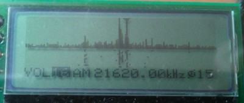
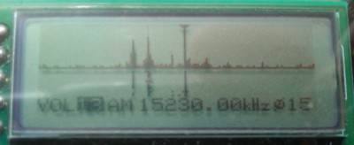
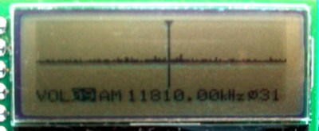
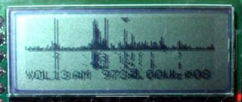
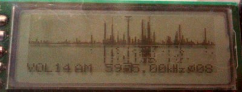
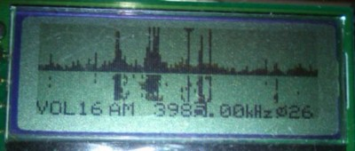

## ポータブルでスタンドアローンなソフトウェアラジオ，ゼネラルカバレッジ版
## Portable and standalone SDR using AD9851 DDS

---
### 概要
ポータブルでスタンドアローンなソフトウェアラジオの製作例です。DDSのAD9851とミキサ612を使った構成で、国内AMから案外遠くの短波放送まで聞けます。AD9851のデータシートにクアドラチャの応用例が書いてありますが、本当にやる人間がいたのか、という感じの回路です。スペクトル（スペクトラム）が出て、ウォーターフォール表示できて、長波～短波をカバーしています。一応、ゼネラルカバレッジ受信機ということで。

 
全体像です。右側のプッシュボタンで、ゲインや選局を選んで、ツマミで値を変更します。周波数は、20 kHzから65000 kHzまで設定できます。国内の中波AM、短波のラジオNIKKEIや、いろんな海外放送が聞けます。選局は最小0.01 kHz刻みまで自由に変えられます。同調の選択度は結構高く、音声AM局で5 kHz離れていれば混信はほとんどありません。  
　周波数の低い方は、長波帯の50 kHz以下がノイズが多くて聴くのが難しいですが、そこから上は使えます。高い方は、30 MHz以上は入ってくる局が少ないので、どこまで受信できているのかわかりません。  
　銅色の部分にアナログ部が隠れています。右側の出来合いのモジュール２つがAD9851です。全体を秋月の樹脂ケースに入れて、大きさはおよそ横110 mm、縦100 mm、厚30 mmです。 

液晶表示です。上半分が周波数スペクトルです。横１ピクセルが4.16 kHz幅、スペクトル全幅は532 kHzです。中央のTBS(954 kHz)を選局しているところで、スペクトルの上の▼が選局位置を示しています。左の小さいのが米軍AFN(810 kHz)で、右の強いのが文化放送(1134 kHz)です。スペクトルの下はウォーターフォールです。だいたい１秒間隔で降りていきます。  
　一番下の行は、左から音量（ゲイン）、復調（AMだけ）、周波数の順で、一番右が局発の位相調整です。プッシュボタンで項目を選んで反転表示させ、ツマミで値を変えます。横幅と局発の位相の件については一番下に書きました。  

シールドの銅張基板を取ったところです。まだ製作途中の写真でRF前段がありません。コンデンサの多い回路です。 

### 回路図

いろいろ検討していったら、全体に面白みのない回路になってしまいました。今回は局発を正弦波にして、3fや5fの高調波をなくすのを目的にしました。移相回路とかいろいろ考えましたが、結局DDSを２つ使うことにしました。それをどこから調達するかですが、ちょうどいいデバイスを調べたら  
AD9958（２出力）：国内＠4500円  
AD9851（１出力）：国内＠2500  
AD9851モジュール：eBayで中国直送＠1400、国内＠2000ぐらいから  
でした。デバイス自体をいじくってもよかったのですが、値段とお手軽感に負けてAD9851のモジュールを２つ注文しました。届いたモジュールは、よく出回っている回路と変わらない感じで、正弦波出力をLPFに通してスプリアスがとれた信号（たぶん）を使っています。位相が90度ちがう信号にするために、片方のクリスタルで両方駆動するように配線し、裏でパターンをカットしています。  
　RF前段は、初め省略していましたが、短波帯でゲインが足りなかったので2SC3355で１段だけ作りました。中波帯以下ではあまりゲインが出ないように定数を決めています。もともと強い局は強くなりすぎるらしく、FMのゴーストが入るようになってしまって、痛し痒しです。ミキサはギルバートセルのSA612(NE612)を使いました。602と並んで伝統あるチップです。その出力をオペアンプで差動増幅しています。612はレギュレータも入っているので、電源ノイズを気にしなくていいです。    
　局発は、SA612Aのデータシートに外部から入れるときは200-300 mVppと書いてあったので、いい加減ですが抵抗で分圧して210 mVぐらいにして入れてます。半固定抵抗は振幅が同じぐらいになるように調整します。熱電圧より相当高いので、高調波はどうなるんだろうと思いましたが、ほとんど入りません。中で振幅を調整している可能性もあります。本気な場合は、RFのゲインに気をつけて、局発を20 mV以下にするのもいいと思います。  
　PICまわりは前とほとんど同じです。6 MHzのクリスタルがありますが、これを使うと6 Mとか12 MHzとかでRFにノイズが入るので止めてあります。代わりに内部発振＋PLLを使っています。コアの動作周波数は計算上は39.936 MHzで、最大2%変動するそうです。  
　AD9851の制御信号は5 Vにプルアップして、初めはオープンドレインしていました。でも、信号が正論理なのに波形の立ち上がりが遅く、抵抗を小さくしたりしましたが、うまく制御できないことがあるようなので、結局オープンドレインはやめました。プルアップされていますが、意味なくなっています。5 V耐性のピンなのでいいことにしています。本当はレベル変換の回路が必要だと思います。  
　AFアンプは、PICのDAC部分のデータシートには差動増幅の回路が書いてあったのですが、せっかく平衡出力されているのでBTLもいいかと思い、試してみました。音量は２号機より大きくなり、うまくいってる感じです。これならスピーカも鳴らせそうです。オペアンプは電流がとれるものということで手持ちからNJU7043を選びました。音質は普通です。気にする場合は4580なんかも使えると思います。ヘッドホンは左右が直列になるように結線しています。  
　電源は、予想はしていましたが、消費電流が実測360 mAと大きいです。AD9851が熱くなるくらいなので、仕方ないです。パナEvoltaも秋月GoldenPowerも何時間かで終わりました。SA612の動作電圧が4.5 V以上で、それより低くなると感度が落ちて発振気味になり、位相もぐるぐる変わるようになります。次に液晶がおかしくなって、最後は2.5 VでPICのBORがかかります。  
　材料はネックになるのがDDSのAD9851です。注文先はeBayで探しましたが、こればかりはご自身のご判断で。届かなかったこともあるので、そう思って取引するしかないです。それが２ヶで送料込3000円ちょっとです。ミキサのSA612は探せば手に入ると思います。602でもいいです。その他そろえて全部で6000円～7000円です。  

### 使用感
以下の局を確認しています。アンテナは、BNCから1 mぐらいのアンテナ線をのばして窓枠に引っ掛けているだけです。窓枠が重要というわけでもないみたいです。時間帯はいろいろで、近場が多いですが、地球の裏側からも短波放送が入っています。  
　周波数はDDSの設定値です。小数点以下まで自由に変えられます。製作時に局発を測ったときは、設定とほとんど差はありませんでした。強度「FSゲイン」はピークをフルスケールに合わせた時のゲイン(VOL)の設定値で、小さいほど強い信号です。ここでいう「ゲイン」は、信号処理でのゲインで、１段階で√2倍です。「-」は測定忘れか、弱かったかです。RF前段を作る前（＊印）と作った後（印なし）が混ざってます。RF前段を追加して、感度はずいぶんよくなりました。

<table>
<tr><th>周波数(kHz)</th><th>局名</th><th>言語</th><th>発信地</th><th>FSゲイン</th><th>聞いた感じなど</th></tr>
<tr><td>594.0</td><td>NHKラジオ第１</td><td>日</td><td></td><td>10*</td><td>普通</td></tr>
<tr><td>693.0</td><td>NHKラジオ第２</td><td>日</td><td></td><td>10*</td><td>弱い</td></tr>
<tr><td>810.0</td><td>AFN</td><td>英</td><td></td><td>8*</td><td>強い</td></tr>
<tr><td>954.0</td><td>TBSラジオ</td><td>日</td><td></td><td>8*</td><td>強い</td></tr>
<tr><td>1134.0</td><td>文化放送</td><td>日</td><td></td><td>4 / 6*</td><td>非常に強い</td></tr>
<tr><td>1242.0</td><td>ニッポン放送</td><td>日</td><td></td><td>-</td><td>弱い</td></tr>
<tr><td>3480.0</td><td>Voice of the People</td><td>コリア</td><td>韓国</td><td>-</td><td>弱い。早朝</td></tr>
<tr><td>3925.0</td><td>ラジオNIKKEI第１</td><td>日</td><td></td><td>11 / 15*</td><td>普通</td></tr>
<tr><td>3945.0</td><td>ラジオNIKKEI第２</td><td>日</td><td></td><td>14*</td><td>普通</td></tr>
<tr><td>3985.0</td><td>Radio Echo of Hope</td><td>コリア</td><td>韓国</td><td>15</td><td>強いがジャミング有。早朝</td></tr>
<tr><td>4010.0</td><td>Kyrgyz Radio</td><td>キルギス</td><td>キルギスBishkek</td><td>-</td><td>弱いがなんとか聞ける</td></tr>
<tr><td>5875.0</td><td>Voice of America</td><td>コリア</td><td>フィリピンTinang</td><td>14</td><td>強い</td></tr>
<tr><td>5955.0</td><td>China Radio International</td><td>英</td><td></td><td>13*</td><td>普通</td></tr>
<tr><td>6055.0</td><td>ラジオNIKKEI第１</td><td>日</td><td></td><td>11</td><td>弱い</td></tr>
<tr><td>6070.0</td><td>朝鮮の声放送</td><td>日</td><td></td><td>-</td><td>普通</td></tr>
<tr><td>6115.0</td><td>ラジオNIKKEI第２</td><td>日</td><td></td><td>11</td><td>普通</td></tr>
<tr><td>6600.0</td><td>Voice of the People</td><td>コリア</td><td>韓国</td><td>-</td><td>弱い。ジャミング有</td></tr>
<tr><td>7260.0</td><td>北京放送</td><td>日</td><td></td><td>12*</td><td>強い</td></tr>
<tr><td>7325.0</td><td>北京放送</td><td>日</td><td></td><td>-</td><td>弱い</td></tr>
<tr><td>7580.0</td><td>朝鮮の声放送</td><td>日</td><td></td><td>15*</td><td>強い</td></tr>
<tr><td>9580.0</td><td>KBS World Radio</td><td>日</td><td></td><td>15</td><td>普通</td></tr>
<tr><td>9650.0</td><td>朝鮮の声放送</td><td>日</td><td></td><td>10*</td><td>強い</td></tr>
<tr><td>9735.0</td><td>台湾国際放送</td><td>日</td><td></td><td>-</td><td>強い</td></tr>
<tr><td>9760.0</td><td>Adventist World Radio KSDA</td><td>露</td><td>グアム</td><td>14</td><td>最後に英語のアナウンス。早朝</td></tr>
<tr><td>11795.0</td><td>KBS World Radio</td><td>スペイン</td><td></td><td>-</td><td>強い</td></tr>
<tr><td>11810.0</td><td>KBS World Radio</td><td>日，スペイン</td><td></td><td>9 / 13*</td><td>強い</td></tr>
<tr><td>11810.0</td><td>BBC</td><td>英</td><td>南大西洋 Ascension島</td><td>16</td><td>ノイズあるが聞ける。早朝 クイーンズイングリッシュ</td></tr>
<tr><td>12050.0</td><td>Dandal Kura Radio</td><td>Kanuri</td><td>南大西洋 Ascension島</td><td>16</td><td>ノイズあるが聞ける。早朝</td></tr>
<tr><td>12065.0</td><td>Radio Australia</td><td>英</td><td>豪南部 Shepparton</td><td>16</td><td>ノイズ多。フェージング大 オーストラリアの話題</td></tr>
<tr><td>13590.0</td><td>China Radio International</td><td>英</td><td></td><td>-</td><td>普通</td></tr>
<tr><td>15160.0</td><td>China Radio International</td><td>中</td><td></td><td>13 / 14*</td><td>強い</td></tr>
<tr><td>15230.0</td><td>Radio Cairo</td><td>スワヒリ</td><td>カイロ近郊 Abu Zaabal</td><td>13</td><td>強い</td></tr>
<tr><td>15575.0</td><td>KBS World Radio</td><td>スペイン</td><td></td><td>17*</td><td>普通</td></tr>
<tr><td>17605.0</td><td>China National Radio 1</td><td>中</td><td></td><td>-</td><td>弱い</td></tr>
<tr><td>17625.0</td><td>China National Radio 2</td><td>中</td><td></td><td>-</td><td>弱い</td></tr>
<tr><td>17770.0</td><td>Radio Free Europe</td><td>露</td><td>タイ Udon Thani</td><td>17</td><td>弱い</td></tr>
<tr><td>21480.0</td><td>Radio Free Asia</td><td>チベット</td><td>テニアン島</td><td>17*</td><td>このあたりでは明瞭<tr><td>21620.0</td><td>Voice of America</td><td>チベット</td><td>フィリピンTinang</td><td>16</td><td>フェージングあるが強い</td></tr>
</td></tr>
<tr><td>21700.0</td><td>Radio Free Asia</td><td>中</td><td>テニアン島</td><td>14</td><td>強い</td></tr>
</table>
日本語と英語の局は内容などから確認しましたが、それ以外はshort-wave.infoやshortwaveschedule.comで調べました。東アジア系の他に、地球の裏の大西洋からもアフリカっぽい言葉で入ります。初めキルギスの局を受信したときは半信半疑でしたが、英語局なんか聞いていると、どうも本当らしいです。他にも色んな局や正体不明の電波がたくさん入ります。  
　ギルバートセルに入れる局発の振幅は熱電圧よりずっと大きいですが、1/3fや1/5fのゴーストは出ません。むしろ強い局のスペクトルの折り返しで、532 kHz高かったり低かったりするのが出ます。RF前段をつけた後は、FMのゴーストが出てしまうようになりましたが、遠くからも聞けるようになったので許すことにしました。  

休日昼中の13 mバンド。Voice of America (21620 kHz)を選局しています。チベット語とのことですが、中国語と聞き分けられません、すみません。 

 
昼の19 mバンド。Radio Cairo (15230 kHz)を選局。結構強く、それらしい感じの言葉。スワヒリ語だそうです。 

昼の25 mバンド。KBS World Radio (11810 kHz)の独壇場。スペイン語。 

 
夜の31 mバンド。台湾国際放送の日本語放送(9735 kHz)を選局。中央の小さいピークです。 

49 mバンド。英語のChina Radio International (5955 kHz)を選局中。他にもいっぱい聞けない程（本当に）の放送局が見えてます。 

早朝の75 mバンド。Echo of Hope (希望のこだま放送, 3985 kHz)を選局。コリア語。朝からたくさんの放送が見えますが、ジャミングも多いです。 

### ファームウエア

2016.3.21。前作の[2号機](https://sites.google.com/site/portablesdr/)とだいたい同じです。周波数の変更はケタごとに反転させて、10 kHzとか1 kHzとかの刻みで変更できるようにしました。小数点の下一つ目を変えると、その下も変わるバグがあります。初めは復調をAM以外も作るつもりでいましたが、必要なさそうでAMだけです。音声信号の取り方や、表示更新の頻度の件は、前と同じです。オーディオ出力のナイキスト周波数も4.5 kHzぐらいで同じです。  
　表示一番右の「Φ」は局発の位相の調整です。周波数を大きく動かしたり、長い時間使っていると局発の位相がずれるらしく、スペクトルで左右対称の位置にピークが出てくることがあります。そういう時に、対称イメージがなくなるように調整します。中波ならテキトーなAM局で位相が調整できます。短波帯にいる時は強い中華系が使えます。周波数の高い方では、30 MHzにDDSのクロックらしいのが入ってくるので、それを使います。どうして位相がずれるのか、よくわかりません。  
　局発の位相では他にも謎があって、起動時にDDSにRESETをきっちり同時に入れても、２つのDDSの位相がメチャクチャです。上のプルアップのこともあったので、RESET信号の波形を確認して同時になるようにしましたが、位相はランダムな感じを受けました。なので、起動後に位相を変えながらI/Q信号の差を求め、いちばん小さいところから90度ずらした位相に設定しています。怪しいですが、そうするしか解決法がありませんでした。やっぱり3.3 V→5 Vレベル変換しないとダメなのかもしれません。それでも位相がずれていく件は説明つきませんが。  

2016.3.27。PICのクロックがRFに入ってうるさいので、内部RCクロックに変更。DDSはクリスタルなので横軸原点（中央）はまあ信用できますが、横軸の幅はPIC内蔵のFRC依存で、データシート的には最大2%の誤差が出ます。同調点はFFTで３ポイント目にしていて、4.16 kHz x 3 = 12.48 kHzなので、その2% = 0.25 kHzのズレは出るかもしれません。  

2016.4.3。PICマニュアルのI/Oポートのセクションに、連続のビット出力はPORTに書き込むのでなくLATに書き込むべき、との記載を見つけて直しましたが、位相などの動作は変わりませんでした。  

---
このページの内容はMITライセンスの下で提供されています。
ソースコードにはMicrochipのSOFTWARE LICENSE AGREEMENTの残骸も残っています。
掲載した情報は検証はしていますが、ご利用はご自身のご責任でどうぞ。DDSのボードを改造して壊したりしてもしりません。  
---Mizutani Lab---
