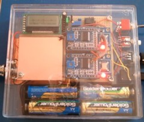
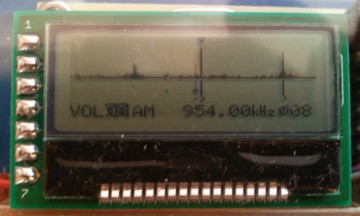
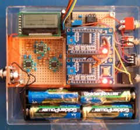
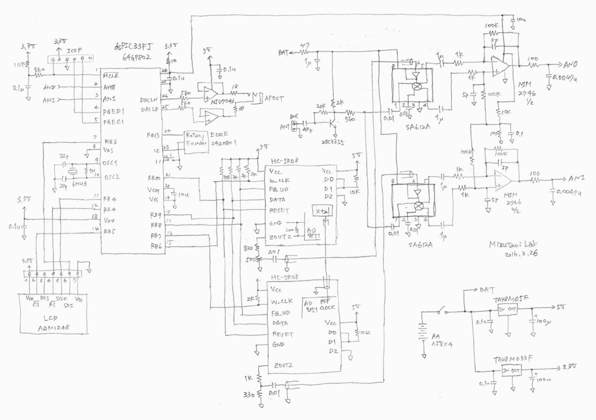

## ポータブルでスタンドアローンなソフトウエア・ラジオ，ゼネラルカバレッジ版
## Portable and standalone SDR (or general coverage receiver)

---
### これまでのあらすじ
* [１号](https://sites.google.com/site/portablesdr/sdr1)　脳までダイオード化される前に踏みとどまり１号となった。
* [２号](https://sites.google.com/site/portablesdr/sdr2)　１号のピンチを救うために造られた。
* Ｖ３　１号２号の目指した理想を胸に生まれた（このページ）。
* [Ｘ](https://sites.google.com/site/portablesdr/home)　　Ｖ３の思いをうけて生まれ変わったが、いま一歩およばない。

### 概要
ポータブルでスタンドアローンなソフトウェアラジオの製作例です。DDSのAD9851とミキサ612を使った構成で、国内AMから案外遠くの短波放送まで聞けます。AD9851のデータシートにクアドラチャの応用例が書いてありますが、本当にやる人間がいたのか、という感じの回路です。スペクトル（スペクトラム）が出て、ウォーターフォール表示できて、長波～短波をカバーしています。一応、ゼネラルカバレッジ受信機ということで。

 

全体像です。右側のプッシュボタンで、ゲインや選局を選んで、ツマミで値を変更します。周波数は、20 kHzから65000 kHzまで設定できます。国内の中波AM、短波のラジオNIKKEIや、いろんな海外放送が聞けます。選局は最小0.01 kHz刻みまで自由に変えられます。同調の選択度は結構高く、音声AM局で5 kHz離れていれば混信はほとんどありません。  
　周波数の低い方は、長波帯の50 kHz以下がノイズが多くて聴くのが難しいですが、そこから上は使えます。高い方は、30 MHz以上は入ってくる局が少ないので、どこまで受信できているのかわかりません。  
　銅色の部分にアナログ部が隠れています。右側の出来合いのボード２つがAD9851です。全体を秋月の樹脂ケースに入れて、大きさはおよそ横110 mm、縦100 mm、厚30 mmです。

液晶表示です。上半分が周波数スペクトルです。横１ピクセルが4.16 kHz幅、スペクトル全幅は532 kHzです。中央のTBS(954 kHz)を選局しているところで、スペクトルの上の▼が選局位置を示しています。左の小さいのが米軍AFN(810 kHz)で、右の強いのが文化放送(1134 kHz)です。スペクトルの下はウォーターフォールです。だいたい１秒間隔で降りていきます。  
　一番下の行は、左から音量（ゲイン）、復調（AMだけ）、周波数の順で、一番右が局発の位相調整です。プッシュボタンで項目を選んで反転表示させ、ツマミで値を変えます。横幅と局発の位相の件については一番下に書きました。  

シールドの銅張基板を取ったところです。まだ製作途中の写真でRF前段がありません。コンデンサの多い回路です。  

### 回路図

いろいろ検討していったら、全体に面白みのない回路になってしまいました。今回は局発を正弦波にして、3fや5fの高調波をなくすのを目的にしました。移相回路とかいろいろ考えましたが、結局DDSを２つ使うことにしました。それをどこから調達するかですが、ちょうどいいデバイスを調べたら  
AD9958（２出力）：国内＠4500円  
AD9851（１出力）：国内＠2500  
AD9851ボード：ebayで中国直送＠1400、国内＠2000ぐらいから  
でした。デバイス自体をいじくってもよかったのですが、値段とお手軽感に負けてebayでAD9851のボードを２つ注文しました。届いたボードは、よく出回っている回路と変わらない感じで、正弦波出力をLPFに通してスプリアスがとれた信号（たぶん）を使っています。位相が90度ちがう信号にするために、片方のクリスタルで両方駆動するように配線し、裏でパターンをカットしています。  
　RF前段は、初め省略していましたが、短波帯でゲインが足りなかったので2SC3355で１段だけ作りました。中波帯以下ではあまりゲインが出ないように定数を決めています。もともと強い局は強くなりすぎるらしく、FMのゴーストが入るようになってしまって、痛し痒しです。ミキサはギルバートセルのSA612(NE612)を使いました。602と並んで伝統あるチップです。その出力をオペアンプで差動増幅しています。612はレギュレータも入っているので、電源ノイズを気にしなくていいです。  
　局発は、SA612Aのデータシートに外部から入れるときは200-300 mVppと書いてあったので、いい加減ですが抵抗で分圧して210 mVぐらいにして入れてます。半固定抵抗は振幅が同じぐらいになるように調整します。熱電圧より相当高いので、高調波はどうなるんだろうと思いましたが、ほとんど入りません。中で振幅を調整している可能性もあります。本気な場合は、RFのゲインに気をつけて、局発を20 mV以下にするのもいいと思います。  
　PICまわりは前とほとんど同じです。6 MHzのクリスタルがありますが、これを使うと6 Mとか12 MHzとかでRFにノイズが入るので止めてあります。代わりに内部発振＋PLLを使っています。コアの動作周波数は計算上は39.936 MHzで、最大2%変動するそうです。  
　AD9851の制御信号は5 Vにプルアップして、初めはオープンドレインしていました。でも、信号が正論理なのに波形の立ち上がりが遅く、抵抗を小さくしたりしましたが、うまく制御できないことがあるようなので、結局オープンドレインはやめました。プルアップされていますが、意味なくなっています。5 V耐性のピンなのでいいことにしています。本当はレベル変換の回路が必要だと思います。  
　AFアンプは、PICのDAC部分のデータシートには差動増幅の回路が書いてあったのですが、せっかく平衡出力されているのでBTLもいいかと思い、試してみました。音量は２号機より大きくなり、うまくいってる感じです。これならスピーカも鳴らせそうです。オペアンプは電流がとれるものということで手持ちからNJU7043を選びました。音質は普通です。気にする場合は4580なんかも使えると思います。ヘッドホンは左右が直列になるように結線しています。  
　電源は、予想はしていましたが、消費電流が実測360 mAと大きいです。AD9851が熱くなるくらいなので、仕方ないです。パナEvoltaも秋月GoldenPowerも何時間かで終わりました。SA612の動作電圧が4.5 V以上で、それより低くなると感度が落ちて発振気味になり、位相もぐるぐる変わるようになります。次に液晶がおかしくなって、最後は2.5 VでPICのBORがかかります。  
　材料はネックになるのがDDSのAD9851です。注文先はebayで探しましたが、こればかりはご自身のご判断で。評価を気にしているショップをさがしてPayPal払いがいいと思いますが、確実なことは言えません。だまされないようにして下さい。注文の時は、ShippingをChina PostのStandard Internationalにしてトラッキングできるようにしました。注文翌日発送で、だいたい10日ぐらいで届きました。それが２ヶで送料込3000円ちょっとです。ミキサのSA612は探せば手に入ると思います。602でもいいです。その他そろえて全部で6000円～7000円です。  

